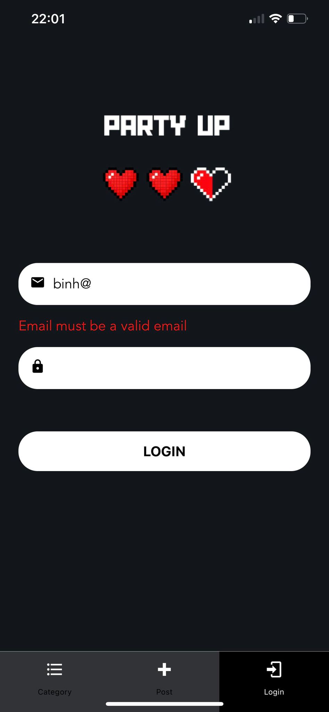
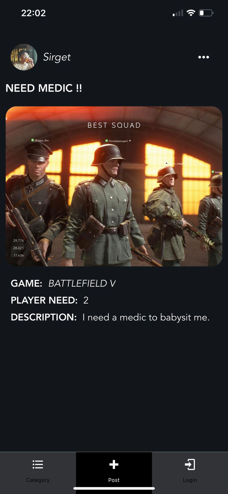
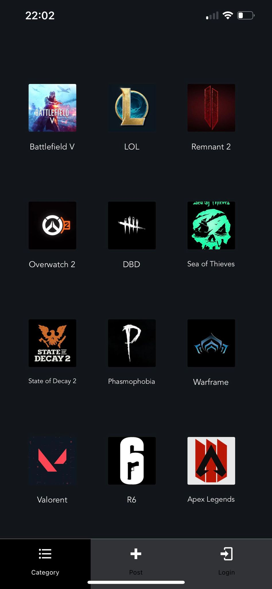

# Dub Hackathon 2023: PartyUp (Synergy Track)

## Developer: Binh Pham Nguyen Thanh, UX/UI Designer: Hung Nguyen

## About: 
PartyUp is an innovative mobile application designed to be the ultimate companion for gamers who seek like-minded teammates for multiplayer adventures. Whether it's tackling challenging raids, conquering dungeons, or participating in match-making games, PartyUp brings players together to enhance the gaming experience. This mobile application is software that our team represents in the Dub Hackathon 2023 at UW.

## Softwares:
Visual Studio Code, React Native

## Screens:
  

## Implementation:
**1. Front-end Data Validation with Yup and Formik:**
* Input Field Validation: Implement data validation for input fields such as username, password, and email.
* Custom Validation Rules: Define custom validation rules using Yup to ensure that data conforms to specific criteria.
* Error Messages: Display informative error messages when users input invalid data, helping them understand and correct errors.
* Real-time Validation: Perform validation in real-time as users enter data, providing immediate feedback.
* Submission Validation: Ensure that the form is only submitted when all data passes validation criteria.

**2. Page Form with Formik:**
* Form Components: Create form components for various sections of your app.
* Form State Management: Manage form state and user input, making it easy to track and update the form data.
* Dynamic Forms: Enable dynamic forms that adapt to the specific needs of each page or section, including optional and required fields.
  
**3. Tab Navigation with React Native Navigation:**
* Tab Bar Navigation: Create a tab bar with navigation items for different sections or features of your app.
* Tab Switching: Allow users to switch between tabs by tapping on the associated icons or labels in the tab bar.

## Potential Improvements
1. Offline Mode: Develop an offline mode that allows users to access essential features and browse for parties even when they are not connected to the internet.
2. User Profiles: Users can create detailed profiles, showcasing their gaming preferences, skill levels, and gaming history. These profiles help in effective party-finding, ensuring that players team up with individuals who share similar interests and skills.
3. Notifications: The app sends timely notifications to users about party invitations, messages, and updates related to the games they are interested in.

